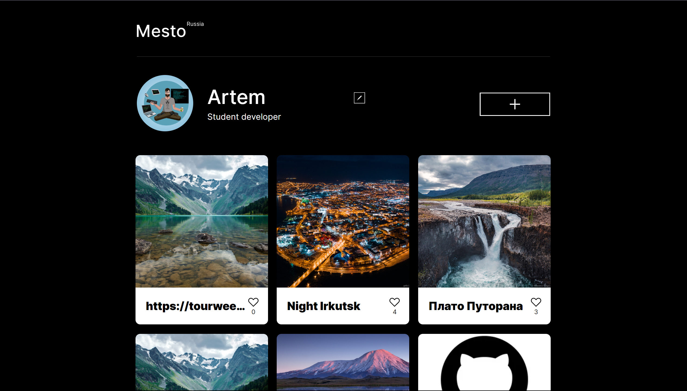

# Проект: "Mesto"🌍

###

  

### 📜Описание:
"Mesto" - это одностраничный сайт в котором имеется профель с именем и професией, аватаром профиля, изображением красивых мест с их названиями.

### 🪄 Функционал
- Редактировать имя профиля и статус;
- Добавлять свои кастомные карточки;
- Удалять свои карточки по кнопке;
- Поставить лайк любой карточке;
- Открыть картинку карточки отдельно почти во весь экран;
- Все карточки, профиль, аватар загружается с сервера, при изменении загружается на сервер;
- Реализовано плавное открытие и закрытие;
- Настроена валидация полей и блокирование кнопки при ошибках;
- Функционал разбит на файлы.

### 🛠️ Технологии:
- JavaScript
- Flexbox / grid
- @media
- ООП
- Module
- Webpack

* [Ссылка на проект Mesto Russia](https://asaevartemv.github.io/mesto/index.html)
